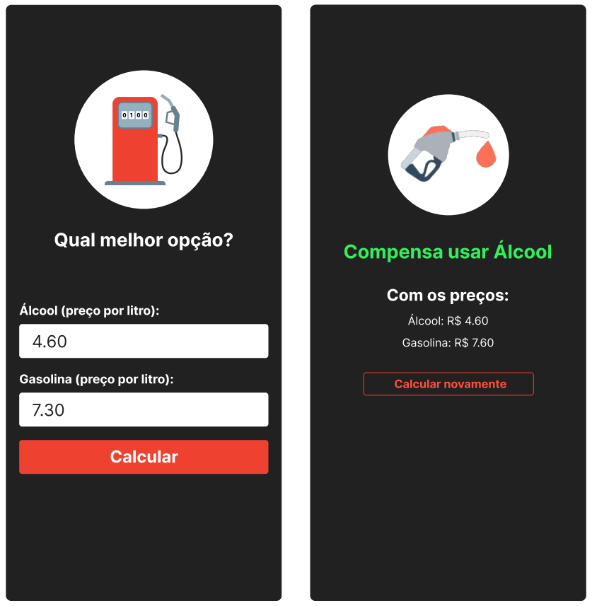

<h1>Abastecimento</h1>

<h2>Como calcular:</h2>

Dividimos o valor do litro do álcool pelo da gasolina.

Quando o resultado é menor que 0.7, a recomendação é abastecer com álcool. Se maior, a recomendação é escolher a gasolina.

Exemplo: se o álcool custa R$ 3.29 e a gasolina R$ 4.92, o resultado da divisão do primeiro pelo segundo é menor que 0.7. Portanto, é mais vantajoso abastecer com álcool.

