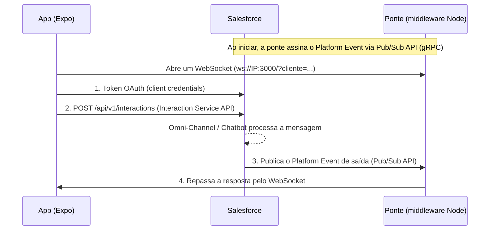

# Bring Your Own Channel (BYOC)

App de chat em React Native (Expo) que funciona como um **canal de mensagens próprio** conectado ao **Salesforce Messaging** através do *Bring Your Own Channel*.

O cliente conversa pelo app, a mensagem chega no Salesforce (Omni-Channel / Chatbot / Agentforce) e a resposta volta para o app em tempo real.

## Demonstração

<!-- Para exibir o player aqui: edite este README no GitHub, arraste o VideoDemo.mp4 para
     o editor e substitua esta linha pelo link https://github.com/user-attachments/assets/... gerado -->

▶️ [Assistir ao vídeo de demonstração](./assets/VideoDemo.mp4)

## Como funciona

No BYOC, o Salesforce não conversa direto com o canal externo. Cada sentido da conversa usa uma API diferente:



| Sentido | Quem faz | Como |
|---|---|---|
| **Entrada** (cliente → Salesforce) | `App.js` | REST na **Interaction Service API** (`/api/v1/interactions`), em `multipart/form-data` |
| **Saída** (Salesforce → cliente) | `middleware/src/pubsub.js` | Assina o Platform Event pela **Pub/Sub API** (gRPC) e repassa ao app por **WebSocket** |

### Por que existe uma ponte (middleware)?

A Pub/Sub API usa **gRPC sobre HTTP/2**, que depende de módulos do Node (`http2`, `tls`...) que **não existem no React Native**. Por isso, quem assina o Pub/Sub é um processo Node rodando no computador, e o app recebe as mensagens dele por WebSocket.

```
Salesforce ──Pub/Sub (push)──► Ponte ──WebSocket (push)──► App
```

Assim as respostas chegam no instante em que o Salesforce publica o evento, sem *polling*.

### O evento de saída

O Salesforce publica um Platform Event (ex.: `Test_Event__e`) para **tudo** que acontece na conversa: mensagens, "digitando", etc. O conteúdo vem no campo `Payload__c` como **texto JSON**:

```jsonc
{
  "EventType__c": "Interaction",
  "Payload__c": "{ \"recipient\": { \"subject\": \"cliente-teste-003\" }, \"payload\": { \"entryType\": \"Message\", ... } }"
}
```

A ponte faz o `JSON.parse` do `Payload__c` e:
- usa `recipient.subject` para saber **para qual cliente** entregar;
- usa `payload.entryType` para filtrar: só `Message` vira balão no chat (`TypingStartedIndicator` / `TypingStoppedIndicator` aparecem apenas no log);
- lê o texto em `payload.entryPayload.abstractMessage.staticContent.text`.

## Estrutura do projeto

```
BringYourOwnChannel/
├── App.js                  # Tela do chat: envia mensagens e recebe respostas via WebSocket
├── Components/
│   └── Mensagem.js         # Balão de mensagem (cliente à direita, bot/agente à esquerda)
├── Api/
│   ├── getToken.js         # Axios para a org (token OAuth)
│   └── sendMsg.js          # Axios para a Interaction Service API (domínio salesforce-scrt.com)
├── assets/                 # Ícones e vídeo de demonstração
├── .env.example            # Modelo das variáveis do app
└── middleware/             # Ponte Pub/Sub → WebSocket (Node)
    ├── src/pubsub.js
    ├── package.json
    └── .env.example        # Modelo das variáveis da ponte
```

## Pré-requisitos

- Node.js **20.6+** (a ponte usa `node --env-file`)
- App **Expo Go** no celular (ou emulador)
- Celular e computador na **mesma rede Wi-Fi**
- Uma org Salesforce com:
  - **Messaging for In-App and Web / Bring Your Own Channel** configurado (Messaging Channel + Channel Address)
  - **Platform Event de saída** do BYOC (ex.: `Test_Event__e`, com os campos `Payload__c`, `EventType__c`, `Recipient__c`)
  - **External Client App / Connected App** com o fluxo *client credentials* habilitado

## Configuração

### 1. Variáveis de ambiente

Copie os modelos e preencha com os dados da sua org:

```bash
cp .env.example .env
cp middleware/.env.example middleware/.env
```

**`.env` (app)**: lido pelo Metro na hora de gerar o bundle. Só variáveis com prefixo `EXPO_PUBLIC_` chegam ao `App.js`.

| Variável | Descrição |
|---|---|
| `EXPO_PUBLIC_SF_URL` | Domínio da org (`https://SEU-DOMINIO.my.salesforce.com`) |
| `EXPO_PUBLIC_SF_SCRT_URL` | Domínio da Interaction Service API (`https://SEU-DOMINIO.my.salesforce-scrt.com`) |
| `EXPO_PUBLIC_SF_CLIENT_ID` / `EXPO_PUBLIC_SF_CLIENT_SECRET` | Credenciais da Connected App |
| `EXPO_PUBLIC_SF_ORG_ID` | Id da org (header `OrgId`) |
| `EXPO_PUBLIC_SF_AUTHORIZATION_CONTEXT` | Developer name do canal (header `AuthorizationContext`) |
| `EXPO_PUBLIC_SF_CHANNEL_ADDRESS_ID` | `channelAddressIdentifier` do canal (campo `to`) |
| `EXPO_PUBLIC_CLIENTE` | Identificador do cliente no canal (campo `from`) |
| `EXPO_PUBLIC_PONTE_URL` | Endereço da ponte: `ws://IP-DO-SEU-PC:3000` |

**`middleware/.env` (ponte)**: carregado pelo `node --env-file=.env`.

| Variável | Descrição |
|---|---|
| `SF_LOGIN_URL` | Domínio da org |
| `SF_CLIENT_ID` / `SF_CLIENT_SECRET` | Credenciais da Connected App |
| `SF_TOPICO` | Tópico do Platform Event de saída (ex.: `/event/Test_Event__e`) |
| `PORTA` | Porta do WebSocket (padrão `3000`; não use `8081`, que é a do Metro) |

> Para descobrir o IP do computador no Windows: `ipconfig` (campo *Endereço IPv4*).

### 2. Instalar as dependências

```bash
npm install
cd middleware && npm install
```

## Executando

São **dois processos**, cada um em um terminal:

**Terminal 1: ponte Pub/Sub**
```bash
cd middleware
npm start
```
Saída esperada:
```
Connected to Pub/Sub API endpoint api.pubsub.salesforce.com:7443
Escutando /event/Test_Event__e e aceitando apps em ws://<ip-do-pc>:3000
```

**Terminal 2: app**
```bash
npx expo start -c
```
Escaneie o QR Code com o Expo Go. Quando o app abrir, a ponte mostra `App conectado: cliente-teste-003`.

## Problemas comuns

| Sintoma | Causa provável |
|---|---|
| `Network Error` / `Erro na ponte` | A ponte não está rodando, o IP em `EXPO_PUBLIC_PONTE_URL` está errado ou o celular está em outra rede |
| `Upgrade Required` | O app está rodando uma versão antiga do código (que fazia HTTP). Recarregue com `r` no terminal do Expo |
| Variável do `.env` chega como `undefined` | O Expo não foi reiniciado com `-c` depois de alterar o `.env` |
| Resposta do bot não aparece no app | Veja o log da ponte: se aparecer `Mensagem sem texto simples`, o formato da mensagem é diferente de texto simples |
| Celular não alcança a ponte | Firewall do Windows bloqueando a porta 3000 para o Node |

## Limitações (projeto de estudo)

- **Segurança:** o `client_secret` está em uma variável `EXPO_PUBLIC_`, então fica **dentro do app instalado**. Em produção, a autenticação e o envio devem passar pelo middleware, e o segredo nunca deve sair do servidor.
- **Mensagens perdidas:** a ponte não guarda nada. Se o app estiver fechado quando a resposta chegar, ela se perde. O Pub/Sub permite retomar pelo `replayId`, o que ainda não foi implementado.
- **Apenas texto:** anexos, botões e outros tipos de mensagem são ignorados.
- **Cliente fixo:** o identificador do cliente vem do `.env` (`EXPO_PUBLIC_CLIENTE`).

## Tecnologias

- [Expo](https://docs.expo.dev/) / React Native
- [Axios](https://axios-http.com/)
- [react-native-safe-area-context](https://docs.expo.dev/versions/latest/sdk/safe-area-context/)
- [salesforce-pubsub-api-client](https://www.npmjs.com/package/salesforce-pubsub-api-client)
- [ws](https://www.npmjs.com/package/ws)

## Referências

- [Bring Your Own Channel for Messaging](https://developer.salesforce.com/docs/service/messaging-partner/guide/introduction.html)
- [Interaction Service API](https://developer.salesforce.com/docs/service/interaction-service-api/guide/get-started.html)
- [Schemas da Interaction Service API](https://github.com/salesforce-misc/interaction-service-apis)
- [Pub/Sub API (Trailhead)](https://trailhead.salesforce.com/content/learn/modules/pub-sub-api-basics)
